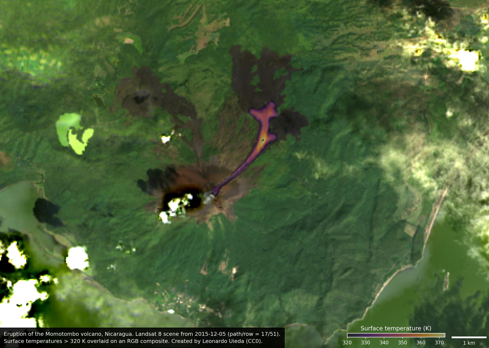

# Plot Landsat 8 scenes of the Momotombo 2015 eruption

Download some selected Landsat 8 scenes that show the state of the eruption and
make plots to show what's going on.
Uses [xlandsat](https://www.compgeolab.org/xlandsat) to load the scenes and
make composites.

The scenes were downloaded from [USGS Earth Explorer](https://earthexplorer.usgs.gov/)
and archived on figshare: https://doi.org/10.6084/m9.figshare.21931089

<figure>

<figcaption>
RGB composite overlaid with surface temperature pseudo-color for temperatures >
320 K to highlight the ongoing lava flow.
</figcaption>
</figure>

## License

All Python source code is made available under the
[MIT license](https://github.com/compgeolab/momotombo-landsat-2015/blob/main/LICENSE).
You can freely use and modify the code, without warranty, so long as you provide
attribution to the authors.

Unless otherwise specified, all figures and Jupyter notebooks are available under the
[Creative Commons Public Domain Dedication (CC0)](https://creativecommons.org/publicdomain/zero/1.0/).
